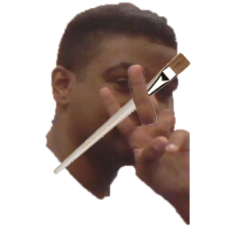
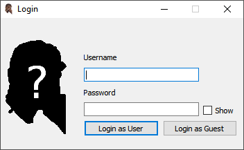
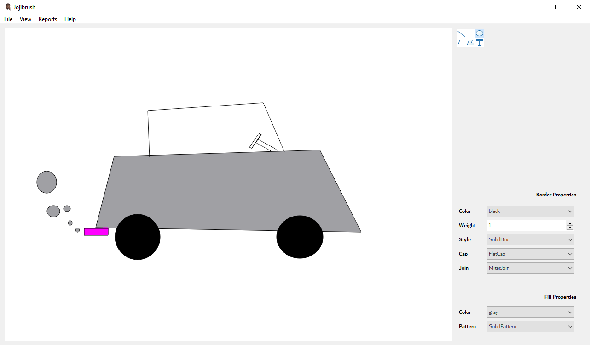
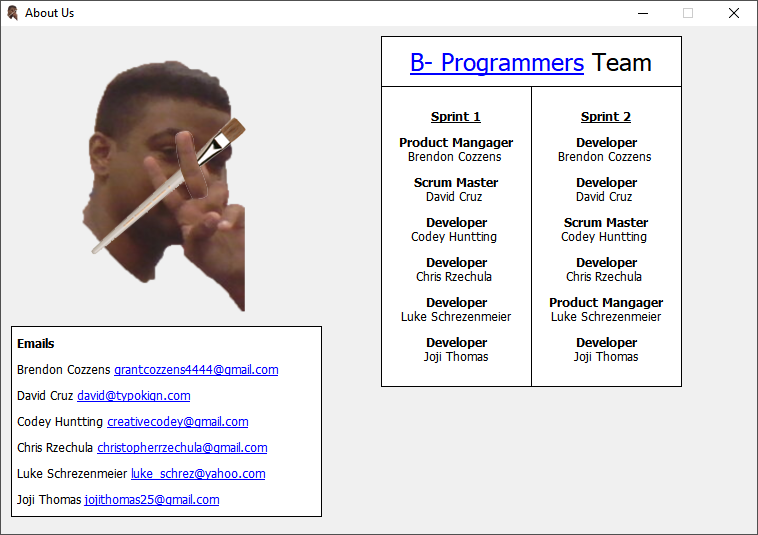

# Jojibrush

An graphics editor that can create images through the use of different shapes and properties. 

* Multiple shapes can be drawn onto the canvas
* Border and fill properties can be changed for respective shapes
* Images can be saved to a special formatted `.jbrush`; these files can also be opened through the program
* The canvas can also be exported to a `.png`, `.jpg`, or `.bmp` image file
* Shape IDs can be toggled on and off on the canvas
* Reports on the shapes on the canvas can be exported to a text file; they reports can be sorted by ID, area, or perimeter

# Login

As of v1.0, there has been a login window with static login credentials. This is planned to be changed in v2.0 to allow the ability to register many accounts and introduce password hashing.

# Canvas

The main goal of the program is to allow a similar experience to MSPaint. With the help of drawing tools, you can create images on the canvas.

# About us

This was a class project using Agile. With 2 sprints and 3 weeks each, we created v1.0 of this program.